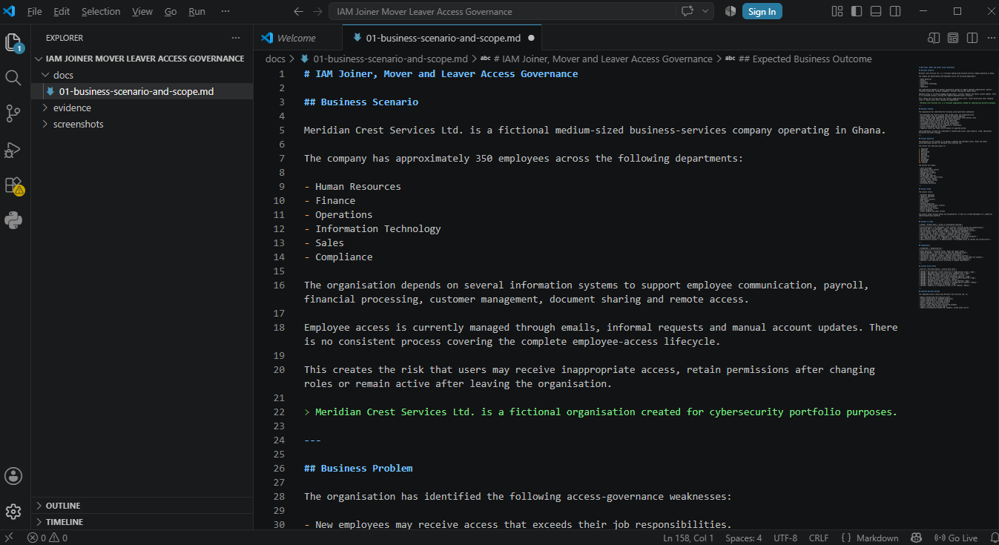
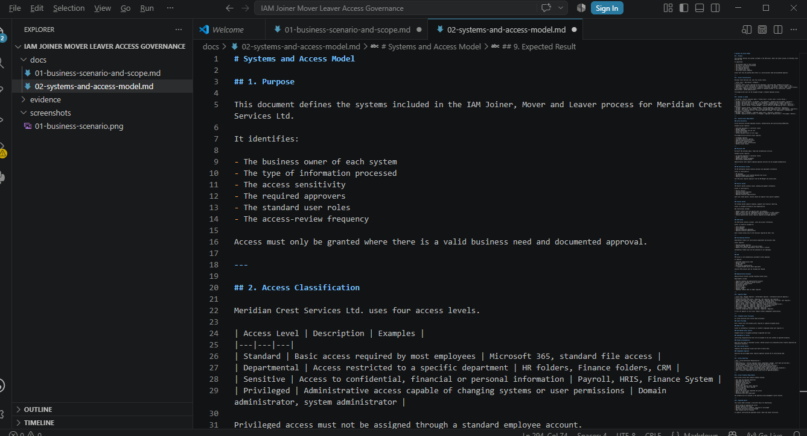
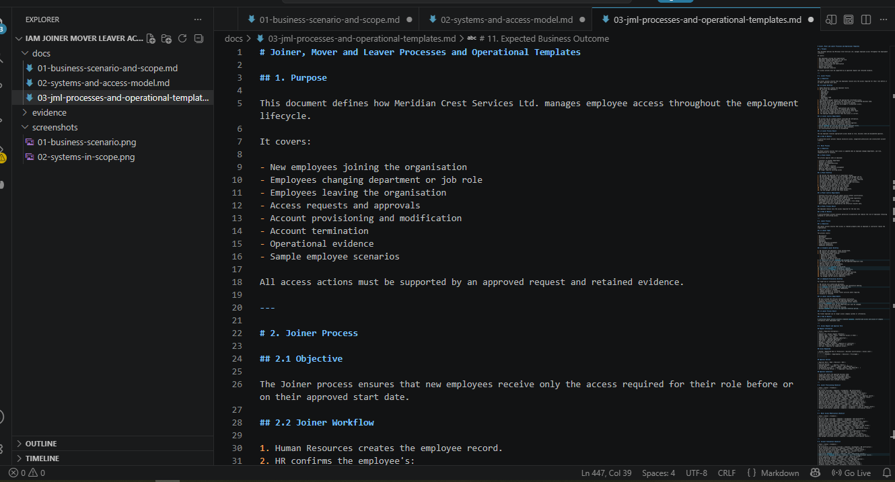
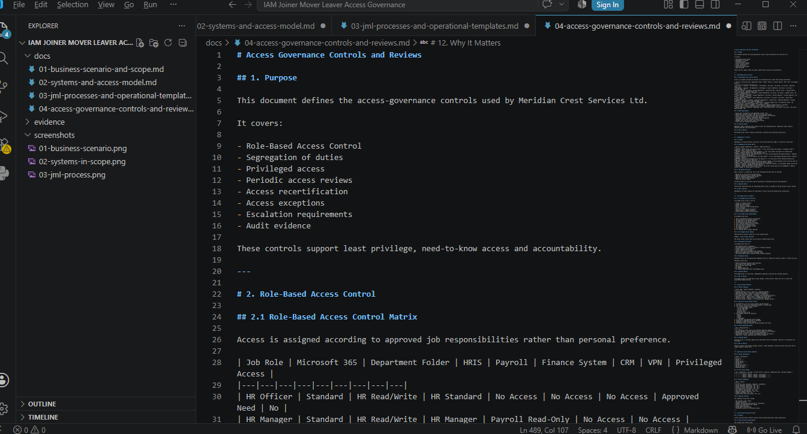
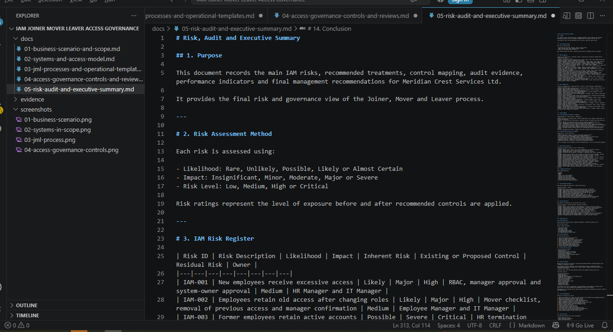
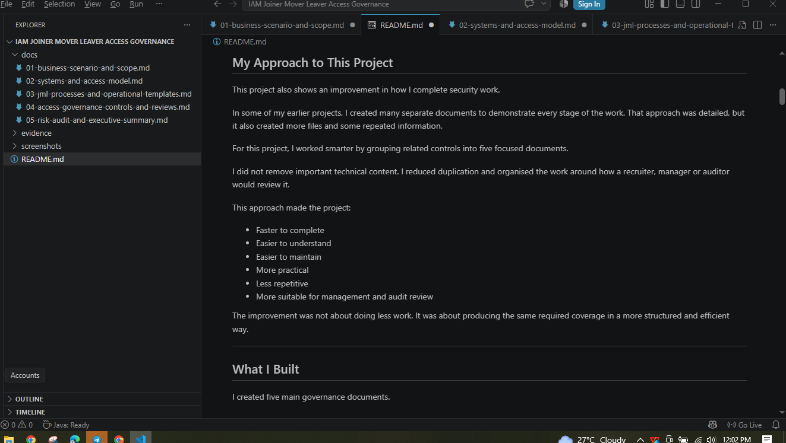

# IAM Joiner, Mover and Leaver Access Governance

## Project Overview

This project demonstrates how employee access can be controlled throughout the employment lifecycle.

I designed a complete and auditable Joiner, Mover and Leaver process for a fictional medium-sized organisation called **Meridian Crest Services Ltd.**

The process covers how access is:

- Requested
- Approved
- Provisioned
- Modified
- Reviewed
- Recertified
- Revoked
- Escalated
- Documented for audit

The project focuses on practical IAM risks such as excessive permissions, outdated access, orphaned accounts, privileged-access misuse and weak segregation of duties.

> Meridian Crest Services Ltd. is a fictional organisation created for cybersecurity portfolio purposes.

---

## The Business Situation

Meridian Crest Services Ltd. has approximately 350 employees working across:

- Human Resources
- Finance
- Operations
- Information Technology
- Sales
- Compliance

Employee access was being managed through emails and informal requests.

There was no consistent process for managing access when employees joined the organisation, changed roles or left the company.

This created several risks:

- New employees could receive inappropriate access.
- Employees could retain permissions from previous roles.
- Former employees could remain active.
- Access could be provisioned without approval.
- Dormant and privileged accounts could remain unreviewed.
- Segregation-of-duties conflicts could go unnoticed.
- Audit evidence could be incomplete.

---

## My Approach to This Project

This project also shows an improvement in how I complete security work.

In some of my earlier projects, I created many separate documents to demonstrate every stage of the work. That approach was detailed, but it also created more files and some repeated information.

For this project, I worked smarter by grouping related controls into five focused documents.

I did not remove important technical content. I reduced duplication and organised the work around how a recruiter, manager or auditor would review it.

This approach made the project:

- Faster to complete
- Easier to understand
- Easier to maintain
- More practical
- Less repetitive
- More suitable for management and audit review

The improvement was not about doing less work. It was about producing the same required coverage in a more structured and efficient way.

---

## What I Built

I created five main governance documents.

### 1. Business Scenario and Scope

Defines:

- The fictional organisation
- The IAM business problem
- Project scope
- Systems in scope
- Stakeholders
- Initial access risks
- Expected business outcomes

### 2. Systems and Access Model

Defines:

- System owners
- Access classifications
- Standard, sensitive and privileged access
- Approval requirements
- Review frequencies
- Access ownership
- Evidence requirements

### 3. Joiner, Mover and Leaver Processes

Defines:

- Joiner workflow
- Mover workflow
- Standard Leaver workflow
- Immediate-termination workflow
- Access request form
- Approval template
- Provisioning checklist
- Access modification checklist
- Account termination checklist
- Sample employee scenarios

### 4. Access Governance Controls and Reviews

Defines:

- Role-Based Access Control matrix
- Segregation-of-duties matrix
- Privileged-access procedure
- Quarterly access-review process
- Access recertification
- Exception management
- Risk-based escalation
- Required audit evidence

### 5. Risk, Audit and Executive Summary

Defines:

- IAM risk register
- Risk treatment plan
- NIST Cybersecurity Framework 2.0 mapping
- ISO/IEC 27001 access-control alignment
- Audit evidence checklist
- Key Performance Indicators
- Key Risk Indicators
- Sample audit test
- Executive summary
- Final recommendations

---

## Joiner Process

The Joiner process begins with verified employee information from Human Resources.

The employee manager confirms the required business access. Sensitive access requires approval from the relevant system owner, while privileged access requires independent Information Security approval.

IT provisions only the approved permissions and records evidence of the completed work.

The employee manager then confirms that the final access is appropriate.

### Main Joiner Controls

- Verified HR record
- Unique employee account
- Role-based access
- Manager approval
- System-owner approval
- Independent privileged-access approval
- Multi-factor authentication
- Provisioning evidence
- Manager confirmation

---

## Mover Process

The Mover process applies when an employee changes department, job role, location or responsibility.

The employee’s previous access is identified and reviewed before new permissions are assigned.

Access connected to the previous role must be removed unless there is a valid and approved business reason to retain it.

A segregation-of-duties review is also completed before sensitive access is granted.

### Main Mover Controls

- Confirmed role change
- Removal of previous-role access
- Approval of new-role access
- Segregation-of-duties review
- Privileged-access reassessment
- Temporary-access expiry dates
- Before-and-after evidence
- New-manager confirmation

---

## Leaver Process

The Leaver process ensures that employee and contractor accounts are disabled at the approved departure time.

For immediate or high-risk terminations, account disablement is coordinated before the termination meeting.

Standard accounts, privileged accounts, VPN access, application access and active sessions are removed or disabled.

Company devices, access cards and security tokens are also recovered.

### Main Leaver Controls

- Official HR termination instruction
- Confirmed final working time
- Active Directory disablement
- Microsoft 365 sign-in blocking
- VPN disablement
- Application-account removal
- Privileged-account disablement
- Active-session termination
- Asset recovery
- Completion evidence

---

## Role-Based Access Control

A Role-Based Access Control matrix was created for common roles, including:

- HR Officer
- HR Manager
- Payroll Officer
- Accounts Payable Officer
- Finance Manager
- Sales Executive
- Compliance Analyst
- IT Support Analyst
- Systems Administrator
- General Employee

The matrix defines the standard access each role should receive.

Access outside the approved role requires documented justification and additional approval.

This supports least privilege and reduces inconsistent access decisions.

---

## Segregation of Duties

The project identifies conflicting access combinations that should not normally be assigned to one person.

Examples include:

- Creating and approving the same vendor
- Creating and approving the same payment
- Preparing and approving payroll
- Requesting and approving personal access
- Provisioning and approving privileged access
- Reviewing and certifying personal access

Where a conflict cannot be removed, a documented exception and compensating control are required.

---

## Privileged Access

Privileged users receive separate administrative accounts.

Administrative accounts must not be used for normal email, web browsing or daily business activities.

Privileged access requires:

- Business justification
- Manager approval
- System-owner approval
- Information Security approval
- Multi-factor authentication
- Activity logging
- Monthly review
- Immediate removal when no longer required

An example administrator naming format is `adm-firstname.lastname`.

---

## Access Reviews and Recertification

Standard, departmental and sensitive access is reviewed quarterly.

Privileged accounts are reviewed monthly.

Reviewers must decide whether each permission should be:

- Retained
- Modified
- Revoked
- Investigated
- Managed through an approved exception

A lack of response is not treated as approval.

The review is complete only when all decisions are recorded, required changes are completed and supporting evidence is retained.

---

## Main Risks Identified

The risk assessment recorded twelve IAM risks.

The highest-risk areas included:

- Former employees retaining active accounts
- Delayed account disablement
- Privileged-access misuse
- Excessive Joiner access
- Previous-role access remaining after transfers
- Unapproved provisioning
- Dormant accounts
- Segregation-of-duties conflicts
- Incomplete access reviews
- Expired temporary access
- Self-approved privileged access
- Shared accounts reducing accountability

The project does not claim that these risks were eliminated in a real production environment.

It demonstrates the controls, procedures and evidence that could be used to reduce them.

---

## Key Recommendations

Meridian Crest Services Ltd. should:

1. Use the documented JML process as the standard access-management procedure.
2. Require HR to initiate all employment lifecycle events.
3. Use approved access profiles for common job roles.
4. Prevent IT from provisioning access without recorded approval.
5. Require independent approval for privileged access.
6. Remove previous-role access during employee transfers.
7. Disable Leaver accounts at the approved departure time.
8. Review privileged accounts monthly.
9. Complete formal access reviews quarterly.
10. Apply expiry dates to temporary and exceptional access.
11. Review dormant accounts monthly.
12. Retain evidence for every access action.

---

## Business Value

This project demonstrates how an organisation can improve access governance without beginning with an expensive identity-governance platform.

A strong documented process can help:

- Reduce excessive access
- Prevent permission accumulation
- Improve Leaver account removal
- Strengthen privileged-access control
- Identify conflicting permissions
- Improve approval accountability
- Support audit testing
- Improve access-review evidence
- Protect confidential information

---

## Evidence Created

All screenshots were created during the project and are stored in the `screenshots` folder.

### Business Scenario

### Systems in Scope

### Joiner, Mover and Leaver Process

### Access Governance Controls

### IAM Risk Register

### README Overview

---

## Repository Contents

| File | Description |
|---|---|
| `docs/01-business-scenario-and-scope.md` | Business problem, scope, stakeholders and initial risks |
| `docs/02-systems-and-access-model.md` | Systems, access classifications, approvals and ownership |
| `docs/03-jml-processes-and-operational-templates.md` | JML workflows, forms, checklists and scenarios |
| `docs/04-access-governance-controls-and-reviews.md` | RBAC, SoD, privileged access, reviews and exceptions |
| `docs/05-risk-audit-and-executive-summary.md` | Risk register, audit evidence, metrics and recommendations |
| `screenshots/` | Original project evidence |
| `evidence/` | Reserved for supporting evidence records |

---

## Skills Demonstrated

- Identity and Access Management
- Joiner, Mover and Leaver governance
- Role-Based Access Control
- Least privilege
- Need-to-know access
- Segregation of duties
- Privileged-access governance
- Access reviews
- Access recertification
- Exception management
- Risk assessment
- Risk treatment planning
- Audit evidence design
- Control mapping
- KPI and KRI development
- Security documentation
- Executive communication

---

## Tools Used

- Visual Studio Code
- Markdown
- GitHub
- NIST Cybersecurity Framework 2.0 concepts
- ISO/IEC 27001 access-control concepts

---

## What This Project Shows About My Development

This project shows that I am improving both technically and professionally.

I can now take a large security problem, identify the main control areas and organise the work without creating unnecessary repetition.

I still covered the complete IAM lifecycle, but I used fewer and stronger documents.

This demonstrates:

- Better planning
- Stronger documentation structure
- Improved time management
- Better understanding of control relationships
- More confidence in deciding what evidence is necessary
- Greater focus on business and recruiter value

The main lesson is that strong security work is not measured by the number of documents created.

It is measured by whether the controls are complete, practical, understandable and auditable.

---

## Limitations

This project is a documented simulation.

It does not include:

- Live Active Directory configuration
- Real employee information
- Automated provisioning
- A commercial identity-governance platform
- Production access logs
- Real access-review records
- Formal ISO certification
- A live compliance assessment

The project demonstrates IAM process design, access-risk assessment and governance documentation.

---

## Future Improvements

Future technical improvements could include:

- Microsoft Entra ID integration
- Automated HR-to-IAM provisioning
- Automated account disablement
- Privileged Access Management integration
- Time-based access expiration
- Automated dormant-account reports
- Access-review dashboards
- ServiceNow approval workflows
- PowerShell account-management scripts
- Centralised privileged-activity monitoring

---

## Final Statement

I designed an auditable Joiner, Mover and Leaver access-governance process that addresses risks related to excessive, outdated, unauthorised and orphaned access.

The project combines IAM lifecycle controls, RBAC, segregation of duties, privileged-access governance, periodic reviews, risk assessment and audit evidence into one practical security-governance solution.
